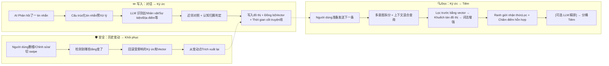

# 🧠 ST-BME — SillyTavern 仿生Ký ức生态

> **让 AI 真正记住你们的故事。**
>
> ST-BME 把对话中散落的Nhân vật、Sự kiện、Địa điểm、关系Tự độngTrích xuất为đồ thị ký ức，在下一轮生成前精准Truy hồi，让长期 RP 的Nhân vật不再"失忆"。

---

## ✨ 核心能力

- 🧩 **Tự độngTrích xuất** — AI Phản hồi后Tự động从上下文中抽取Nhân vậtTrạng thái、Sự kiện、Địa điểm、Quy tắc、tuyến chính等Cấu trúc化Ký ức
- 🔍 **多层混合Truy hồi** — VectorNgữ nghĩaTìm kiếm + Khuếch tán đồ thị + 词法增强 + Ranh giới nhận thứcLọc + 可选 LLM 精排，精准Tiêm
- 🧠 **认知架构** — 主Khách quan分层Ký ức、Nhân vật视角Ký ức、空间邻接感知、Thời gian cốt truyện线，模拟真实认知
- 🌐 **đồ thị可视化** — 内置力导向đồ thị面板，直观查看Ký ứcnút之间的关系
- 🎨 **4 套配色主题** — Crimson Synth / Neon Cyan / Amber Console / Violet Haze
- 📱 **手机端适配** — 底部 Tab Bar + 精简布局，手机也能用
- 🔄 **历史安全** — 删楼、Chỉnh sửa、切 swipe 时Tự động回滚Khôi phục，不留脏Ký ức
- 🧹 **污染标签清理** — Mặc định清理 thinking/choice/UpdateVariable 等常见污染标签，可自định nghĩaRegex
- 📦 **不改酒馆本体** — 纯第三方扩展，即装即用

---

## 🧭 工作原理

整个插件可以拆成三件事：**写入**（把对话变成Ký ức）、**Đọc**（把Ký ức送回给 AI）、**安全**（出了问题能Khôi phục）。



### 写入阶段（对话 → Ký ức）

每lần AI Phản hồi后，插件会把Gần nhất几轮对话打包发给 LLM（可以是你聊天用的同一个Model，也可以单独配一个），让它识别出"这段对话里出现了哪些Nhân vật、发生了什么事、在哪里、有什么新Quy tắc"等等。

**Trích xuấtPipeline预Xử lý**：

1. **Cấu trúc化tin nhắn** — 对话被规范为带 `seq/role/speaker/name/rawContent/sourceType` 的Cấu trúc化tin nhắn
2. **Assistant 边界Lọc** — Mặc định排除 `think/analysis/reasoning` 等推理标签Nội dung，可自định nghĩaTrích xuất/排除Quy tắc
3. **分层上下文** — 对话切片、đồ thịTrạng thái、总结snapshot、Thời gian cốt truyện线、Schema định nghĩa作为独立上下文字段传给 LLM
4. **世界书集成** — Trích xuất时可选择是否解析世界书Nội dung，复用酒馆原生世界书扫描逻辑

识别出来的Kết quả不是直接塞进去——插件会先跟已有Ký ức做对比（通过VectorTìm kiếm找相似的），如果已经有了就Cập nhật，如果是真正的新Nội dung才创建。同时会判定Ký ức的**认知归属**（Nhân vật视角/Người dùng视角/Khách quan）和**空间区域**。

写入之后，还可能触发一些后续Xử lý：

- **Hợp nhất** — 相似Ký ức合并（Mem0 精确对照 + A-MEM 进化）
- **Nén** — 太多类似的Sự kiệnKý ức会被层级合并
- **Tóm tắt phân tầng** — 基于近期原文窗口Tạo tóm tắt ngắn，并在前沿过厚时继续做Gộp tóm tắt
- **Phản tư** — 长期模式总结，生成叙事指导原则
- **遗忘** — 很久没被用到的Ký ức降低优先级

### Đọc阶段（Ký ức → Tiêm）

当你准备发送下一 tin nhắn时，插件会抢在 AI 生成之前做一轮"Truy hồi"：

1. **多意图拆分** — Tự động识别Người dùngtin nhắn中的多个意图，分别检索
2. **上下文混合查询** — 融合当前Người dùng输入 + 上一轮 AI Phản hồi + 前一条Người dùngtin nhắn的加权查询
3. **Lọc trước bằng vector** — 用 Embedding 找到Ngữ nghĩa最相关的候选
4. **Khuếch tán đồ thị** — 沿关系网络向外扩散，发现间接Liên kết
5. **词法增强** — 关键词精确匹配加权，弥补纯Ngữ nghĩaTìm kiếm的盲区
6. **Ranh giới nhận thứcLọc** — 按Nhân vật视角/Người dùng视角/Khách quan区域Lọc和加权
7. **Chấm điểm hỗn hợp** — Vector相似度 × Khuếch tán đồ thị能量 × nút重要性 × 时间新旧 × 认知权重
8. **多样性采样** — DPP 采样避免Truy hồiNội dung过于同质
9. **[可选] LLM 精排** — 让 LLM 从候选池中挑选最相关的Ký ức
10. **格式化Tiêm** — 选出最终入围的Ký ức，分类整理后Tiêm到 prompt 里

Tiêm的Nội dung分成两层：

- **Core（常驻层）** — Quy tắc、tuyến chính，以及在没有Tiền tuyến tóm tắt hoạt động时兜底的旧式Toàn cục概要
- **Recalled（动态层）** — 根据当前对话语境Truy hồi的

每层内进一步按用途分桶：Trạng thái hiện tại / 情景Sự kiện / Phản tư锚点 / Quy tắc约束。

**Truy hồi prompt 分段**：recall 的 LLM prompt 将 recentMessages 拆分为"上下文回顾"和"当前Truy hồi目标"两段 system message，帮助Model更好地区分参考信息和当前Tác vụ。

### 安全机制（历史变动 → Khôi phục）

这是很多Ký ức插件忽略的问题：如果Người dùng删了某 tin nhắn、Chỉnh sửa了Nội dung、或者切了 swipe，已经基于那 tin nhắnTrích xuất的Ký ức就变成"脏"的了。

ST-BME 的Xử lý方式是：

1. 给每条已Xử lý的tin nhắn计算 hash（指纹）
2. 发现 hash 变了 → 找到最早受影响的位置
3. 把那之后产生的Ký ức和VectorTất cả回滚
4. 从变动点重新走一遍Trích xuất流程

如果Khôi phục日志损坏了，会退化为全量重建——慢一点但保证正确。

**Lưu bền稳态保障**：

- IndexedDB 热路径走增量提交（`buildPersistDelta`），不再整图替换
- `accepted/recoverable` Ngữ nghĩa分层：只有 IndexedDB 和 chat-state 计入 accepted；shadow 与 metadata-full 仅为 recoverable Neo khôi phục
- Restore Lock 门禁：Thủ công重建/Nhập/云Khôi phục等Thao tác期间，Tự độngTrích xuất/Truy hồi/Lưu bền重试Tự động暂停

---

## 🚀 安装

### 方法一：通过 SillyTavern 扩展安装

1. 打开 SillyTavern → 扩展 → 安装扩展
1. 输入仓库地址：

```text
https://github.com/Youzini-afk/ST-Bionic-Memory-Ecology
```

注意：请粘贴仓库根地址，不要使用像 `/graphs/code-frequency` 这样的 GitHub 子页面地址。

1. 刷新页面

### 方法二：Thủ công安装

```bash
cd SillyTavern/data/default-user/extensions/third-party
git clone https://github.com/Youzini-afk/ST-Bionic-Memory-Ecology.git st-bme
```

重启 SillyTavern 即可。

---

## ⚡ 快速上手

1. **Mở bảng** — 左上角 ≡ 菜单 →「🧠 đồ thị ký ức」
2. **Bật插件** — 进入面板的「Cấu hình → Công tắc chức năng」，打开 ST-BME Ghi nhớ tự động
3. **Cấu hình Embedding** — 进入「Cấu hình → Cấu hình API」，选择Chế độ vector并填好Model
4. **开始聊天** — Bình thường跟Nhân vật对话，插件会Tự động在后台Trích xuất和Truy hồi

> **最少Cấu hình：** 只勾选"Bật"就能跑起来。Mặc định会复用你当前的聊天Model做Trích xuất。

---

## 📝 Ký ứcLoại

插件会把对话拆解成以下几种Ký ứcnút：

| Loại | 说明 | 举例 |
| ------ | ------ | ------ |
| 🧑 Nhân vật | Nhân vật的Trạng thái hiện tại、性格、外貌变化 | "小明因为淋雨感冒了" |
| ⚡ Sự kiện | 发生过的事 | "河边的告白" |
| 📍 Địa điểm | Địa điểmTrạng thái | "废弃实验室，门被锁上了" |
| 📌 Quy tắc | 世界观thiết lập、约束 | "魔法会消耗生命力" |
| 🧵 tuyến chính | Tác vụ线/剧情线 | "寻找失踪的项链" |
| 📜 Toàn cục概要（旧） | 单条Toàn cục前情提要，现主要用于兼容 / 迁移兜底 | — |
| 💭 Phản tư | 长期规律总结 | "他们经常在夕阳下聊天" |
| 👁️ Ký ức chủ quan | Nhân vật视角下的Ký ức，含误解和Cảm xúc | "她以为他离开了，其实他躲起来了" |

这些nút之间还会建立关系（参与、发生在、推动、矛盾、Cập nhật、时序Cập nhật等），形成一张完整的Ký ức网络。

### 认知架构

ST-BME 的Ký ức不是扁平的——它模拟了真实的认知分层：

**主Khách quan分层**：

- **Khách quan层** — Sự kiện、Địa điểm、Quy tắc等事实性Ký ức，按空间区域组织
- **主观层（POV）** — Nhân vật视角Ký ức，包含信念、Cảm xúc、Thái độ，甚至允许"误解"（`certainty: mistaken`）

**空间感知**：

- Ký ức按空间区域归属（Khu vực hiện tại/邻接区域/Toàn cục）加权Truy hồi
- Nhân vật移动时，相关区域的Ký ức权重Tự động调整

**Thời gian cốt truyện线**：

- 每条Ký ức带有Thời gian cốt truyện标记（当前/近过去/远过去/闪回/未来）
- 时间线上下文可Tiêm prompt，帮助Model保持时间感知
- 支持软引导（`storyTimeSoftDirecting`），不强制但提示Model注意时间流

### Trạng thái tóm tắt

当前主用的总结体系不是 `synopsis` nút，而是 `summaryState` 中持续演化的「Tóm tắt ngắn + Gộp tóm tắt」Tiền tuyến hoạt động。

---

## 🔧 设置说明

### LLM bộ nhớ

用来做Trích xuất、Nén、Hợp nhất、Tóm tắt ngắn、Gộp tóm tắt、Phản tư等Tác vụ的Model。

- **留空** → 复用当前 SillyTavern 的聊天Model（最简Cấu hình）
- **填写** → 你可以指定一个独立的 OpenAI-compatible Model专门Xử lýKý ức
- **Tự động检测** → 插件会Tự động检测是否Cấu hình了专用的LLM bộ nhớ 提供商

### Embedding（VectorTìm kiếm）

VectorTìm kiếm是"智能Truy hồi"的关键。支持两种模式：

#### Backend模式（推荐）

走 SillyTavern Backend的Vector API，最稳定：

- 支持 OpenAI / Cohere / Mistral / Ollama / LlamaCpp / vLLM 等
- 在设置面板选择「Nguồn vector backend」，填好Model名即可
- 不需要单独填 API Key，复用酒馆已有的

#### 直连模式

如果你需要完全独立的 Embedding 服务（比如酒馆Backend不支持的源）：

- 填入 Địa chỉ API Embedding、Key、Model
- 插件直接请求你的 Embedding 服务
- 注意浏览器跨域问题（CORS）

> **切换Chế độ vector/Model后，建议点一lần"Xây lại vector"。**

### Trích xuất设置

| 设置 | Mặc định | 说明 |
| ------ | ------ | ------ |
| Trích xuất mỗi N phản hồi | 1 | 每几条 AI Phản hồi做一lầnTrích xuất |
| Số lượt ngữ cảnh trích xuất | 2 | Trích xuất时向前看几轮对话 |
| Chế độ trích xuất | pending | Thủ côngTrích xuất面板Mặc định模式（pending/rerun），跨会话Ký ức |
| Assistant 排除标签 | think,analysis,reasoning | Mặc định排除的推理标签 |
| Trích xuấttin nhắn上限 | 0（不限） | 限制传入 prompt 的Tin nhắn gần nhất数量 |
| Trích xuất Prompt 模式 | both | 对话传入方式：both/transcript/structured |
| Trích xuất世界书模式 | active | 是否在Trích xuất时解析世界书 |
| 包含Thời gian cốt truyện线 | 开 | Trích xuất prompt 中包含Thời gian cốt truyện线上下文 |
| 包含总结snapshot | 开 | Trích xuất prompt 中包含Tóm tắt hoạt độngsnapshot |

### Truy hồi设置

| 设置 | Mặc định | 说明 |
| ------ | ------ | ------ |
| Top-K lọc trước bằng vector | 20 | Lọc trước bằng vector阶段最多保留多少个候选 |
| Pool ứng viên cho xếp hạng tinh LLM | 30 | 进入 LLM 精排阶段前的候选池大小 |
| Giới hạn chọn cuối cùng của LLM | 12 | LLM 精排后最多保留多少条Ký ức |
| Top-K khuếch tán đồ thị | 100 | Khuếch tán đồ thị阶段最多保留多少个候选 |
| Tiêm深度 | 9999 | 当前走 IN_CHAT@Depth，数值越大越靠前插入 |
| 多意图拆分 | 开 | Tự động识别Người dùngtin nhắn中的多个意图 |
| 上下文混合查询 | 开 | 融合Người dùng输入 + AI Phản hồi + 前一条Người dùngtin nhắn |
| 词法增强 | 开 | 关键词精确匹配加权 |
| 多样性采样 | 开 | DPP 采样避免Truy hồiNội dung过于同质 |
| 时序链接 | 开 | 相邻时间nút的Liên kết增强 |
| Nhân vật视角权重 | 1.25 | 当前Nhân vật视角Ký ức的Truy hồi加权 |
| Người dùng视角权重 | 1.05 | Người dùng视角Ký ức的Truy hồi加权 |
| Khu vực hiện tại权重 | 1.15 | 当前空间区域Ký ức的Truy hồi加权 |
| 邻接区域权重 | 0.9 | 邻接空间区域Ký ức的Truy hồi加权 |
| Toàn cục区域权重 | 0.75 | Toàn cục空间区域Ký ức的Truy hồi加权 |

### 维护设置

| 设置 | Mặc định | 说明 |
| ------ | ------ | ------ |
| BậtHợp nhất | 开 | 相似Ký ứcTự độngHợp nhất |
| Hợp nhất阈值 | 0.85 | Vector相似度高于此值时触发Hợp nhất |
| BậtTóm tắt phân tầng | 开 | Bật「Tóm tắt ngắn + Gộp tóm tắt」主路径（兼容旧 `enableSynopsis` 命名） |
| Tóm tắt ngắn频率 | 3 lầnTrích xuất | 每累计多少lầnTrích xuất生成一条新的Tóm tắt ngắn |
| 折叠扇入 | 3 | 同层Tóm tắt hoạt động达到多少条时触发一lần折叠 |
| BậtPhản tư | 开 | 让 AI 总结长期模式 |
| BậtNén tự động | 开 | Sự kiện/tuyến chínhnút过多时Tự động层级Hợp nhất |
| BậtLãng quên chủ động | 开 | 太久没被用到的Ký ức降低优先级 |
| Bật智能触发 | 关 | 仅在检测到关键Nội dung时才Trích xuất |
| BậtTruy hồi xác suất | 关 | 以一定概率触发Truy hồi，减少 token 消耗 |

### 污染标签清理

插件Mặc định携带 5 条通用RegexQuy tắc，Tự động清理 prompt 中的常见污染标签：

- `thinking/think/analysis/reasoning` — 推理/思维链标签
- `choice` — 选择标签
- `UpdateVariable` — MVU 变量Cập nhật标签
- `status_current_variable` — MVU Trạng thái变量标签
- `StatusPlaceHolderImpl` — MVU Trạng thái占位标签

这些Quy tắc作为 `globalTaskRegex` 的Preset mặc định，Người dùng可以在「系统提示词」Cấu hình页自định nghĩa或清空。如果显式Lưu空Quy tắc，插件不会偷偷加回Mặc địnhQuy tắc。

---

## 🖥️ 操控面板

从左上角 ≡ 菜单点「🧠 đồ thị ký ức」Mở bảng。

### Tổng quan Tab

- 统计Dữ liệu（Nút hoạt động、边、Lưu trữ数、Tỷ lệ phân mảnh）
- Trạng thái chạy（聊天 ID、Trạng thái vector、Trạng thái lưu bền、Trạng thái lịch sử）
- Trích xuất gần nhất / Truy hồi的Ký ức

### Ký ức Tab

- Tìm kiếm和筛选Ký ứcnút
- 点击nút查看详情
- 支持按LoạiLọc

### Tiêm Tab

- 预览当前TiêmNội dung
- 查看 token 消耗

### Thao tác Tab

- Thủ côngTrích xuất — 立即从当前对话Trích xuất（模式选择跨会话Ký ức）
- Nén thủ công — 合并重复/冗余的Sự kiện
- Thực hiện lãng quên — 降低长期Chưa dùngKý ức的优先级
- Tạo tóm tắt ngắn — 基于近期原文窗口生成阶段性总结
- Thực hiện gộp tóm tắt — 折叠当前Tiền tuyến tóm tắt hoạt động
- Xây lại trạng thái tóm tắt — 从Trích xuất批lần重建Tóm tắt ngắn与折叠总结
- Xuất / Nhập đồ thị
- Xây lại đồ thị — 从Chat hiện tạiTrích xuất lạiTất cảKý ức
- Xây lại vector — 重建Tất cảVector索引
- Tiến hóa cưỡng bức — 让新Ký ức影响旧Ký ức

### Cấu hình Tab

Cấu hình页是一个完整的工作区，分成 5 个子页：

- **Cấu hình API** — LLM bộ nhớ、Embedding Vector源
- **Công tắc chức năng** — Trích xuất/Truy hồi/维护各项功能的Bật开关
- **Tham số chi tiết** — 检索Dòng thời gian线、认知架构、维护阈值等细粒度参数
- **系统提示词** — Preset tác vụ模板Chỉnh sửa、Toàn cụcRegexQuy tắc管理
- **Giao diện bảng** — 主题切换、通知模式

桌面端会显示左侧竖向子导航，右侧显示宽版Cấu hình表单；移动端则改成顶部横向子页切换。

### đồ thị可视化

桌面端右侧大区域显示力导向đồ thị，nút可拖拽、缩放、点击查看详情。支持 4 套主题配色切换。

---

## 🔄 历史安全

这是最重要的功能之一。

当你在 SillyTavern 里做以下Thao tác时：

- Xóa某 tin nhắn
- Chỉnh sửa某 tin nhắn
- 切换 swipe

插件会Tự động检测到历史发生了变化，然后：

1. **止损** — 停止当前推进，清空可能失效的Tiêm
2. **回滚** — 找到受影响的批lần，Xóa相关Ký ức和Vector
3. **Khôi phục** — 从变动点Trích xuất lại

这样你就不用担心"改了历史但Ký ức还留着错的Nội dung"的问题。

---

## 📋 Thủ côngThao tác速查

| Thao tác | 说明 |
| ------ | ------ |
| Thủ côngTrích xuất | 不等Tự động触发，立刻Trích xuất当前对话 |
| Nén thủ công | 把重复/冗余的Sự kiệnHợp nhất |
| Thực hiện lãng quên | 降低长期Chưa dùngKý ức的优先级 |
| Tạo tóm tắt ngắn | 基于近期原文窗口生成一条新的阶段性总结 |
| Thực hiện gộp tóm tắt | 将多条同层Tóm tắt hoạt động折叠成更高层总结 |
| Xây lại trạng thái tóm tắt | 从Trích xuất批lần重建Tóm tắt ngắn与折叠总结 |
| Xuất đồ thị | 下载đồ thị hiện tại JSON（不含Vector） |
| Nhập đồ thị | Nhập đồ thị文件（Nhập后需Xây lại vector） |
| Xây lại đồ thị | ⚠️ 清空现有đồ thị，从聊天记录Trích xuất lại |
| Xây lại vector | 重建Tất cảnút的Vector索引 |
| Phạm viXây lại vector | 只重建指定tầngPhạm vi内的Vector |
| Tiến hóa cưỡng bức | 让新Ký ức深度影响旧Ký ức认知 |

---

## 🏗️ 开发者参考

### 文件Cấu trúc

```text
ST-BME/
├── index.js                    # 主入口：Sự kiện绑定、流程调度、历史Khôi phục、Lưu bền协调
├── manifest.json               # SillyTavern 扩展清单
├── style.css                   # Tất cả样式
│
├── graph/                      # 图Dữ liệuModel与领域Trạng thái
│   ├── graph.js                # nút/边 CRUD、序列化、版本迁移
│   ├── graph-persistence.js    # 聊天Metadata、commit marker、shadow snapshot、加载Trạng thái
│   ├── schema.js               # nútLoại Schema định nghĩa（8 种nút + 8 种关系）
│   ├── memory-scope.js         # 主Khách quan分层、空间区域归属
│   ├── knowledge-state.js      # 认知归属、可见性、区域Trạng thái
│   ├── story-timeline.js       # Thời gian cốt truyện线、时间桶分类、时间跨度
│   ├── summary-state.js        # Tóm tắt hoạt độngTrạng thái管理
│   └── node-labels.js          # nút显示名截断
│
├── maintenance/                # 写入链路
│   ├── extractor.js            # LLM Ký ứcTrích xuấtPipeline（对话 → nút/边 → 图Thao tác）
│   ├── extraction-controller.js# Trích xuấtTác vụ编排、Phạm vi重提、批Xử lýLưu bềnsnapshot
│   ├── extraction-context.js   # Cấu trúc化tin nhắn预Xử lý、assistant 边界Lọc
│   ├── chat-history.js         # 对话tầng管理、hash 检测、Khôi phục日志
│   ├── consolidator.js         # 统一Hợp nhất ký ức（Mem0 对照 + A-MEM 进化）
│   ├── compressor.js           # 层级Nén与遗忘
│   ├── hierarchical-summary.js # 层级tóm tắt折叠
│   ├── smart-trigger.js        # 智能触发决策
│   └── task-graph-stats.js     # Tác vụ级đồ thị统计（共享排序核心）
│
├── retrieval/                  # Đọc链路
│   ├── retriever.js            # 三层混合检索编排（Vector + Khuếch tán đồ thị + LLM 精排）
│   ├── shared-ranking.js       # 共享排序核心（查询归一化、上下文混合、Lọc trước bằng vector、词法评分、Khuếch tán đồ thị、混合打分）
│   ├── recall-controller.js    # Truy hồi输入解析与Tiêm控制
│   ├── retrieval-enhancer.js   # 多意图拆分、共现增强、DPP 多样性采样、残差Truy hồi
│   ├── diffusion.js            # Khuếch tán đồ thị算法
│   ├── dynamics.js             # Chấm điểm hỗn hợp与Lượt truy cập强化
│   ├── injector.js             # Truy hồiKết quả格式化Tiêm
│   └── recall-persistence.js   # 持久Truy hồi记录
│
├── prompting/                  # Prompt 构建与模板
│   ├── prompt-builder.js       # Tác vụ Prompt 组装（分层上下文 + 分段 transcript）
│   ├── prompt-profiles.js      # Preset tác vụđịnh nghĩa与Toàn cụcRegex预设
│   ├── default-task-profile-templates.js  # Mặc địnhTác vụ模板源
│   ├── prompt-node-references.js# Prompt nút短引用与截断标签
│   ├── task-regex.js           # Tác vụRegex执行器（复用酒馆Regex + Cục bộQuy tắc）
│   ├── task-worldinfo.js       # Tác vụ级世界书激活引擎（含 EJS 支持）
│   ├── task-ejs.js             # Tác vụ EJS 模板渲染
│   ├── injection-sanitizer.js  # TiêmNội dung清洗（MVU 兼容 + Regex清理）
│   └── mvu-compat.js           # MVU (MagVarUpdate) 兼容层
│
├── llm/                        # LLM 请求封装
│   ├── llm.js                  # LLM bộ nhớ 请求、JSON 输出、流式 SSE、超时、调试脱敏
│   └── llm-preset-utils.js     # LLM 预设工具、OpenAI 兼容提供商检测
│
├── vector/                     # Vector索引
│   ├── vector-index.js         # Embedding Cấu hình、验证、Vector文本构造、检索入口
│   └── embedding.js            # 直连 Embedding API 封装
│
├── runtime/                    # 运行时Trạng thái
│   ├── runtime-state.js        # tầng hash、dirty 标记、批日志、Khôi phục点、归一化
│   ├── settings-defaults.js    # Mặc định设置định nghĩa与迁移
│   ├── generation-options.js   # 生成选项解析
│   ├── user-alias-utils.js     # Người dùng别名检测与匹配
│   ├── debug-logging.js        # Nhật ký gỡ lỗi工具
│   ├── runtime-debug.js        # 运行时诊断
│   ├── request-timeout.js      # 请求超时常量
│   └── planner-tag-utils.js    # Planner 标签工具
│
├── sync/                       # Lưu bền与Đồng bộ
│   ├── bme-db.js               # IndexedDB (Dexie) Dữ liệu层、增量提交、snapshot
│   ├── bme-sync.js             # 云Đồng bộ（/user/files/ 镜像）、备份/Khôi phục、冲突合并
│   └── bme-chat-manager.js     # chatId → BmeDatabase 生命周期管理
│
├── host/                       # SillyTavern Host适配
│   ├── event-binding.js        # HostSự kiện注册与调度
│   ├── st-context.js           # 酒馆上下文snapshot
│   ├── st-native-render.js     # 酒馆原生 EJS 渲染兼容
│   └── adapter/                # Host能力适配层
│       ├── index.js             # 适配器入口
│       ├── capabilities.js     # Host能力检测
│       ├── context.js           # 上下文适配
│       ├── injection.js         # Tiêm适配
│       ├── regex.js             # Regex适配（复用酒馆原生Regex引擎）
│       └── worldbook.js         # 世界书适配
│
├── ui/                         # Người dùng界面
│   ├── panel.js                # Logic tương tác bảng điều khiển
│   ├── panel.html              # 面板 HTML 模板
│   ├── panel-bridge.js         # 懒加载面板与菜单Tiêm
│   ├── ui-actions-controller.js# 面板 action 逻辑封装
│   ├── ui-status.js            # Trạng thái lưu bền UI 文案
│   ├── graph-renderer.js       # Canvas 力导向đồ thị渲染器
│   ├── graph-renderer-utils.js # 渲染工具函数
│   ├── panel-graph-refresh-utils.js # 面板đồ thị刷新工具
│   ├── recall-message-ui.js    # UI thẻ truy hồi theo message（子图渲染 + 侧边栏Chỉnh sửa）
│   ├── hide-engine.js          # 旧tin nhắn隐藏引擎（使用酒馆原生 /hide /unhide）
│   ├── notice.js               # 通知系统
│   └── themes.js               # 4 套主题配色
│
├── ena-planner/                # ENA Planner 子模块
│   ├── ena-planner.js          # Planner 主逻辑
│   ├── ena-planner-storage.js  # Planner 存储
│   ├── ena-planner-presets.js  # Planner 预设
│   ├── ena-planner.html        # Planner UI
│   └── ena-planner.css         # Planner 样式
│
├── vendor/                     # 第三方依赖
│   └── js-yaml.mjs             # YAML 解析器
│
└── tests/                      # Kiểm thử脚本（50+ Kiểm thử文件）
    ├── p0-regressions.mjs      # P0 回归Kiểm thử集
    ├── graph-persistence.mjs   # 图Lưu bềnKiểm thử
    ├── shared-ranking.mjs      # 共享排序Kiểm thử
    └── ...                     # 其他专项Kiểm thử
```

### Dữ liệu存储

- **đồ thịLưu trữ chính（Cục bộ优先）** → `IndexedDB`（Dexie）
  - DB 名固定：`STBME_{chatId}`
  - 热路径走增量提交（`buildPersistDelta`），不再整图替换
  - 运行时主Đọc路径：优先 IndexedDB
- **跨设备Đồng bộ镜像** → SillyTavern 文件 API `/user/files/`
  - Đồng bộ文件名：`ST-BME_sync_{sanitizedChatId}.json`
  - 备份文件名：`ST-BME_backup_{slug}-{hash}.json`
  - 冲突合并：`updatedAt` 新者胜；tombstone `deletedAt` 优先；`lastProcessedFloor/extractionCount` 取 `max`
  - `meta` 为Đồng bộ JSON 顶层首字段，`revision` 全程单调递增
  - 支持Tự động/Thủ công两种云Chế độ lưu trữ
- **兼容兜底（迁移窗口）** → `chat_metadata.st_bme_graph`
  - 仅用于 legacy 兼容与迁移，不再是主路径
- **墓碑（tombstones）** → 保留期固定 30 天
- **插件设置** → SillyTavern 的 `extension_settings.st_bme`
- **Vector索引** → Backend模式走酒馆 API；直连模式存在nút内
- **Truy hồi持久Tiêm** → `chat[x].extra.bme_recall`（tin nhắn级）

### Lưu bền稳态架构

```text
写入路径：
  Trích xuấtKết quả → baseSnapshot → buildSnapshotFromGraph → buildPersistDelta → db.commitDelta
                                                                              ↓
                                                                    单事务内：差量 upsert/delete/tombstone + meta/revision/syncDirty

Lưu bềnLùi về链：
  1. IndexedDB（accepted=true）     ← 首选
  2. chat-state（accepted=true）    ← IndexedDB Không khả dụng时的 accepted fallback
  3. shadow / metadata-full（recoverable=true, accepted=false）  ← Chỉ neo khôi phục
  4. pending persist 队列           ← Tất cảKhông khả dụng时排队等重试

Restore Lock 门禁：
  manual rebuild / graph import / summary rebuild / cloud restore / restore rollback
  → 期间Tự động暂停：Tự độngTrích xuấtKhôi phục / Lưu bền重试 / Truy hồi失效 / 历史Khôi phục
```

### 兼容迁移策略（legacy metadata → IndexedDB）

- 触发：聊天加载/切换后，若目标 `STBME_{chatId}` 为空且存在 legacy `chat_metadata` đồ thị
- Hành vi：Tự động一lần性迁移到 IndexedDB，并立即尝试Đồng bộ到 `/user/files/`
- 幂等：
  - 若 `migrationCompletedAt > 0`，Bỏ qua
  - 若 IndexedDB 已非空，Bỏ qua
- 迁移记录：
  - `migrationCompletedAt`
  - `migrationSource`（Mặc định `chat_metadata`）
  - `legacyRetentionUntil`（30 天）

### Sự kiện挂载

| SillyTavern Sự kiện | 做什么 |
| ------ | ------ |
| `CHAT_CHANGED` | IndexedDB 优先加载 + Tự độngĐồng bộ |
| `GENERATION_AFTER_COMMANDS` | AI Phản hồi后Trích xuấtKý ức |
| `GENERATE_BEFORE_COMBINE_PROMPTS` | Truy hồi trước khi sinh并Tiêm |
| `MESSAGE_RECEIVED` | 触发đồ thịLưu bền（IndexedDB 增量提交） |
| `MESSAGE_SENT` | 发送意图钩子，捕获Đầu vào chuẩn quyền |
| Xóa / Chỉnh sửa / Swipe | 触发历史变动检测与Khôi phục |

### Truy hồiDòng thời gian线

```text
Người dùng输入 → 多意图拆分 → 上下文混合查询
        → Lọc trước bằng vector → Khuếch tán đồ thị → 词法增强
        → Ranh giới nhận thứcLọc → Chấm điểm hỗn hợp → 多样性采样
        → [可选 LLM 精排] → 场景重构 → 分桶Tiêm
```

### Trích xuấtPipeline

```text
AI Phản hồi → Cấu trúc化tin nhắn预Xử lý
        → Assistant 边界Lọc（排除推理标签）
        → 分层上下文组装（对话 + đồ thị + 总结 + 时间线 + Schema）
        → [可选世界书扫描]
        → LLM Trích xuất → 近邻对照 → 认知归属判定
        → 写入đồ thị + Đồng bộVector + Thời gian cốt truyện线
        → [后续维护：Hợp nhất/Nén/Tóm tắt phân tầng/Phản tư/遗忘]
```

### Prompt 构建架构

```text
Preset tác vụ模板（taskProfiles） → buildTaskPrompt
  ├── system: Nhân vật指引 + Quy tắc + 格式định nghĩa
  ├── context blocks:
  │   ├── recentMessages（分段：上下文回顾 / 当前目标）
  │   ├── graphStats（共享排序核心，G1/G2 风格引用，Không裸 UUID）
  │   ├── activeSummaries
  │   ├── storyTimeContext
  │   └── worldInfo（Tác vụ级世界书扫描 + EJS 渲染）
  ├── Schema định nghĩa
  └── Người dùng prompt

Toàn cụcRegex（globalTaskRegex）→ 按 prompt 阶段执行清理
Tác vụCục bộRegex（localRules）→ 按tin nhắn级 role 递归应用
Tiêm清洗（injection-sanitizer）→ MVU 兼容 + 最终安全检查
```

### 持久Truy hồiTiêm（`message.extra.bme_recall`）

Truy hồiTiêm支持tin nhắn级Lưu bền，存放在对应Người dùngtầng：

- 路径：`chat[x].extra.bme_recall`
- 主要字段：
  - `version`
  - `injectionText`
  - `selectedNodeIds`
  - `recallInput`
  - `recallSource`
  - `hookName`
  - `tokenEstimate`
  - `createdAt` / `updatedAt`
  - `generationCount`（**仅**在该持久Tiêm被实际用作生成Lùi về时递增）
  - `manuallyEdited`（仅表示Nguồn是否为人工Chỉnh sửa）

Tiêm优先级（避免双重Tiêm）：

1. **本轮有新Truy hồi成功**：仅使用新Truy hồiTiêm（临时Tiêm），并覆盖写入目标Người dùngtầng的 `bme_recall`。
2. **本轮Không新Truy hồiKết quả**：仅从"当前生成对应的Người dùngtầng"Đọc `bme_recall` 作为Lùi vềTiêm。
3. **两者都Không**：清空Tiêm。

> `manuallyEdited` 不参与优先级判断，不会强制覆盖系统Truy hồi。

tin nhắn级 UI：

- 带有 `bme_recall` 的Người dùngtin nhắn会显示内联卡片（含Người dùngtin nhắn + 🧠 Truy hồi条 + Ký ức数 badge）。
- 显示前提：必须同时满足 **Người dùngtầng**、`message.extra.bme_recall` 存在、且 `injectionText` 为非空字符串。
- 点击Truy hồi条展开，显示**力导向子图**（仅渲染被Truy hồi的nút和它们之间的边，复用 `GraphRenderer`）。
- 子图中nút可拖拽/缩放，点击nút打开**右侧边栏**查看Chi tiết nút。
- Thao tác按钮（展开态底部）：
  - **✏️ Chỉnh sửa**：打开侧边栏Chỉnh sửaVăn bản tiêm（实时 token 计数），Lưu后标记 `manuallyEdited=true`。
  - **🗑 Xóa**：二lầnXác nhận（按钮变红 3s 超时Đặt lại），Xác nhận后移除持久Truy hồi记录。
  - **🔄 Truy hồi lại**：重新执行Truy hồi并覆盖记录，`manuallyEdited` Đặt lại为 `false`。
- 不再使用 `prompt()` / `alert()` / `confirm()` 浏览器原生对话框。
- 当聊天 DOM 延迟插入时，插件会执行**有界重试 + 短生命周期 MutationObserver 补偿**，避免单lần刷新错过挂载。

兼容性说明：

- 旧聊天（Không `extra` 或Không `bme_recall`）会Tự động按"Không持久记录"Xử lý，不会报错。
- Recall Card 依赖tin nhắntầng存在稳定索引属性（如 `mesid` / `data-mesid` / `data-message-id`），不会再Lùi về到 DOM 顺序猜测，以避免误挂载到Lỗitầng。
- 第三方主题至少需要保留 `#chat .mes` 外层tin nhắnnút；卡片会优先尝试挂载到 `.mes_block`，其lần `.mes_text` 的父nút，最后Lùi về到 `.mes` 根nút。
- 若第三方主题完全移除了这些锚点或稳定索引属性，插件会选择**Bỏ qua挂载并输出 `[ST-BME]` Nhật ký gỡ lỗi**，而不是静默挂到Lỗi位置。

排障建议（Dữ liệu存在但 UI 不显示时）：

1. 打开浏览器控制台，Tìm kiếm `[ST-BME] Recall Card UI` 或 `[ST-BME] Recall Card persist` Nhật ký gỡ lỗi。
2. Xác nhận目标tầng是否为**Người dùngtin nhắn**，并检查 `message.extra.bme_recall.injectionText` 是否非空。
3. 检查tin nhắn DOM 是否仍带有稳定tầng索引属性（`mesid`、`data-mesid`、`data-message-id` 等）。
4. 若使用第三方主题，Xác nhậntin nhắnnút仍包含 `#chat .mes`，且tin nhắnNội dung区域未完全移除 `.mes_block` / `.mes_text` 相关Cấu trúc。
5. 如果聊天是异步渲染的，Đang chờ一小段时间后再lần观察；插件会在短时间内Tự động补偿重试，而不是只尝试一lần。

---

## ⚠️ 已知限制

1. **Ký ức质量取决于 LLM** — ModelTrích xuất不准，Ký ức也会不准
2. **直连模式有跨域风险** — 浏览器的 CORS 限制可能导致请求Thất bại
3. **BackendVector仅支持酒馆已有 provider** — 不在列表里的需要用直连
4. **Khôi phục优先正确性** — Nhật ký lô缺失时会退化为全量重建，可能较慢
5. **Ký ức chủ quan依赖Trích xuất质量** — Nhân vật视角Ký ức的"误解"效果需要Model配合

---

## 📄 License

AGPLv3 — 详见 [LICENSE](./LICENSE)
